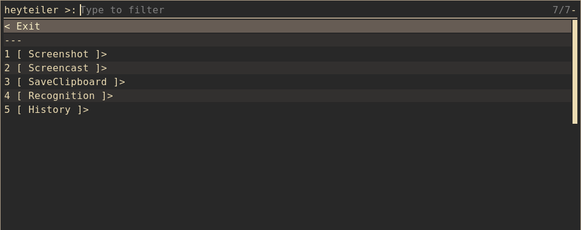

# heyteiler - a little screenshot tool written in bash

heyteiler (forked from [teiler](https://github.com/carnager/teiler)) uses rofi to draw a menu which lets you
choose between screenshots or screencasts.

## Screenshot

## Features
* screenshots fullscreen/monitor/area
* delay of screenshots
* screencasts of monitor/area
* upload screenshots/screencasts - teiler can also upload your files via scp, imgur or filebin, ix (for pastes) and amazon s3.
* History of Images and Videos with support for
  + Viewing
  + Editing
  + Uploading
* Commandline interface for direct access to all features. Useful for hotkeys
* Recognize text and put it in clipboard

## Dependencies:

* xininfo (https://github.com/DaveDavenport/xininfo)
* rofi (https://github.com/DaveDavenport/rofi)
* ffmpeg (http://www.ffmpeg.org)
* xclip
* maim (https://github.com/naelstrof/maim)
* slop (https://github.com/naelstrof/slop)
* copyq (https://github.com/hluk/CopyQ)

## Optional Dependencies

* imgurbash2 (https://github.com/ram-on/imgurbash2)
* filebin (http://git.server-speed.net/users/flo/filebin)
* openssh (http://www.openssh.com)
* ix (http://ix.io)
* s3 cli tools
* tesseract (https://github.com/tesseract-ocr/tesseract)
