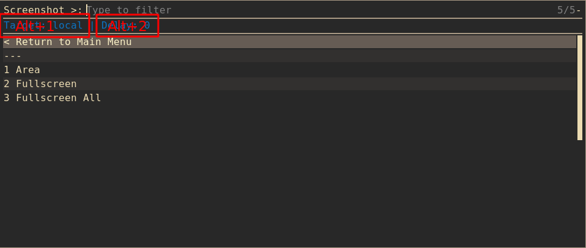

# heyteiler - a little screenshot tool written in bash

heyteiler (forked from [teiler](https://github.com/carnager/teiler)) uses rofi 
to draw a menu which lets you choose between screenshots, screencasts,
saveclipboard or recognize text.

## Screenshot


## Features
* Screenshots fullscreen all/fullscreen/area
* Screencasts of fullscreen/area
* Save clipboard text in file
* Recognize text and put it in clipboard
* Delay screenshots
* Save screenshots in clipboard
* Save filepath of result in clipboard
* Upload your files via: 
    - imgur (only images, require: [imgurbash2](https://github.com/ram-on/imgurbash2)) 
    - ix (only text) 
    - scp (all formats, require: openssh)
    - amazon s3 (all formats, require: s3cmd cli tool)
* History of Images,Videos and Text with support for
  + Viewing
  + Uploading
* Commandline interface for direct access to all features: useful for hotkeys of
    if your don't want to use rofi

## Configuration

Default system configuration storied in the `/etc/heytiler` directory. But for
user defined changes i recommend to copy `/etc/heytiler` folder in user
`$HOME/.config/heytiler` directory

```bash
cp -R /etc/heytiler ~/.config/heyteiler
```

Here you find:
    - heyteiler.conf - main configuration file
    - targets - folder with targets configuration files

## Choises
Some menus has choises in header. For change values in them use rofi keybinds: Alt+1,
Alt+2, Alt+3



## Targets

Targets is main feature of heyteiler. In config directory, you may find targets
folder. Every file in this folder describe one target.
You may change exist target or create your own just copy one of existing.
See `targets` files for more options

Supported `target_type`: 'local', 'scp', 'imgur', 'clipboard'
    - Images: local, clipboard, scp, s3, imgur
    - Video: local, scp, s3
    - Text: s3, scp, ix.io

imgur and ix.io target types worked without any additional settings. So, they
haven't special file. But if you want to change local directory for backups you
may copy `local` target and set `target_type=imgur`.

```bash
cd ~/.config/heyteiler/targets
cp local my_custom_imgur
sed -i 's/target_type=.*/target_type=imgur/' my_custom_imgur
# Change imgur backup directory
sed -i 's/Screenshots/Imgur/' my_custom_imgur
```

### Local target

*DONT REMOVE LOCAL TARGET*

`local` target is a special target which heyteiler use for saving files before
upload on the resource. So even if you use network resource as a target (ex:
imgur or scp) your file will be available in future in `local` target folders or in
history tab.

Also `local` target used for openning files from history.


## Dependencies:

Choose dependencies based on necessary features:

* xclip
* slop (https://github.com/naelstrof/slop)
* xdg-open
* libnotify
* UI dependency:
    * rofi (https://github.com/DaveDavenport/rofi)
* Screenshot dependency
    * maim (https://github.com/naelstrof/maim)
* Screencasts dependencies:
    * xininfo (https://github.com/DaveDavenport/xininfo)
    * ffmpeg (http://www.ffmpeg.org)
* Recognize dependencies:
    * maim
    * tesseract (https://github.com/tesseract-ocr/tesseract)
    * ImageMagic (https://imagemagick.org/index.php)
* Uploading dependencies:
    * curl
    * imgurbash2 (https://github.com/ram-on/imgurbash2)
    * openssh (http://www.openssh.com)
    * s3 cli tools
